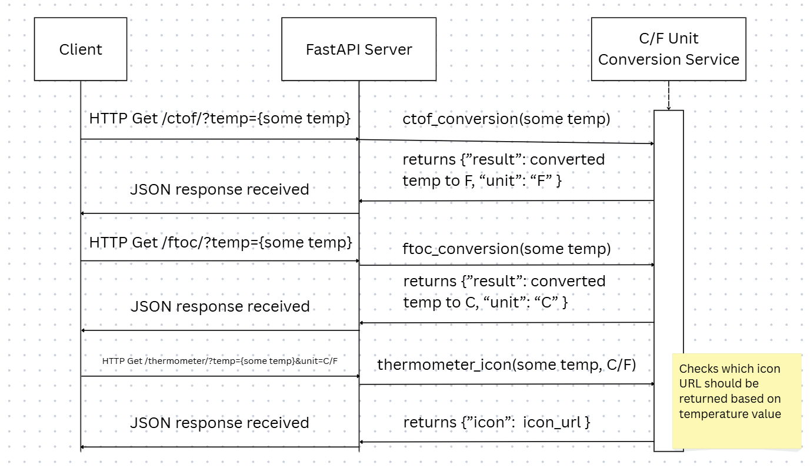

# Oregon State CS361 Microservice 2: C/F Unit Conversion 

## Communication Contract
Given a temperature in Celsius or Fahrenheit, the value will be converted to its equivalent value in the opposite unit and returned.​ Given a temperature either in Celsius or in Fahrenheit, a thermometer icon URL will be retrieved relative to the temperature. 

## API Specification
### Convert Celsius to Fahrenheit
#### Request Example
```http
GET  http://replace-with-your-url/ctof/?temp=20
```
#### Response Example in JSON
```JSON
{
    "result": , 68,
    "unit": "F"
}
```
### Convert Fahrenheit to Celsius
#### Request Example
```http
GET  http://replace-with-your-url/ftoc/?temp=86
```
#### Response Example in JSON
```JSON
{
    "result": , 30,
    "unit": "C"
}
```
### Retrieve Thermometer Icon URL
#### Request Example 
```HTTP
GET http://replace-with-your-url/thermometer/?temp=30&unit=F
```
#### Response Example in JSON
```JSON
{
    "icon_url": "/icons/hot.png"
}
```
# UML 

## Contributing
Meera Gurung - user story 1 & 2 
Jordan Smith 
Chris Mosier
Jericho Arizala - user story 3 & readme

